# Arquitetura do Sistema RAG

Documentação detalhada da arquitetura do sistema de Retrieval-Augmented Generation offline.

## 📐 Visão Geral de Alto Nível

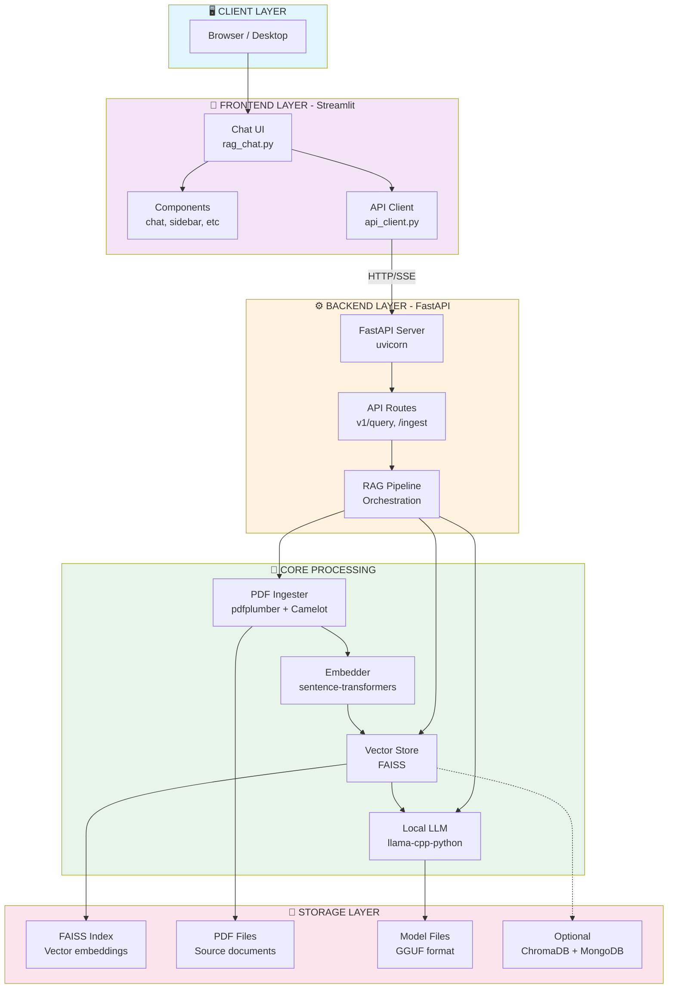

---

## 🔄 Arquitetura de Componentes

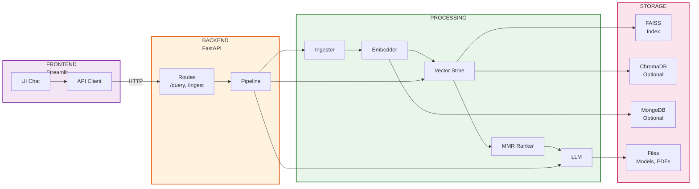

---

## 📊 Pipeline de Query (Pergunta)

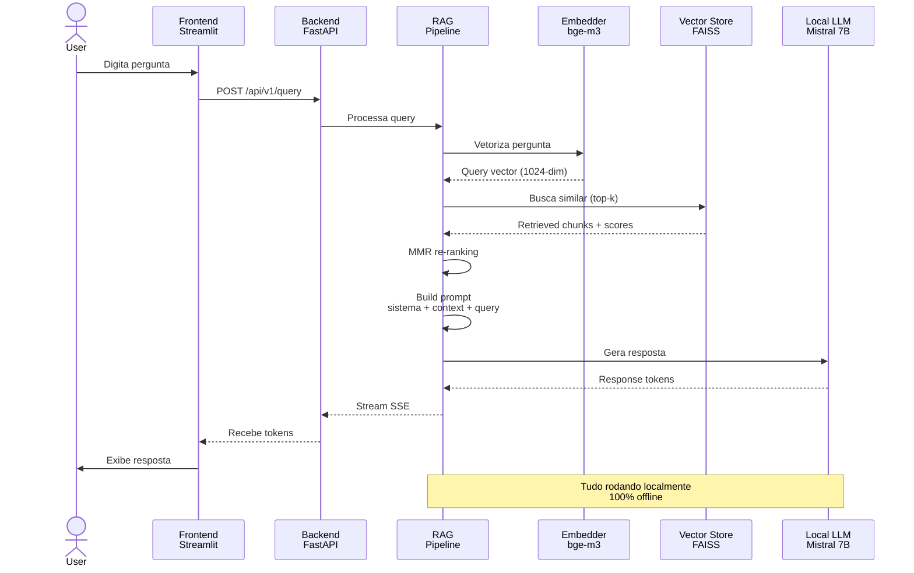

---

## 📥 Pipeline de Ingestão (Ingesta)

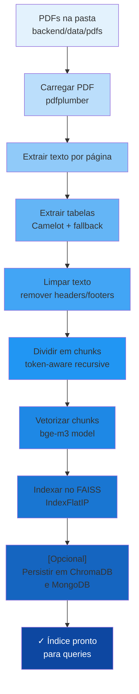

---

## 🏗️ Estrutura do Backend

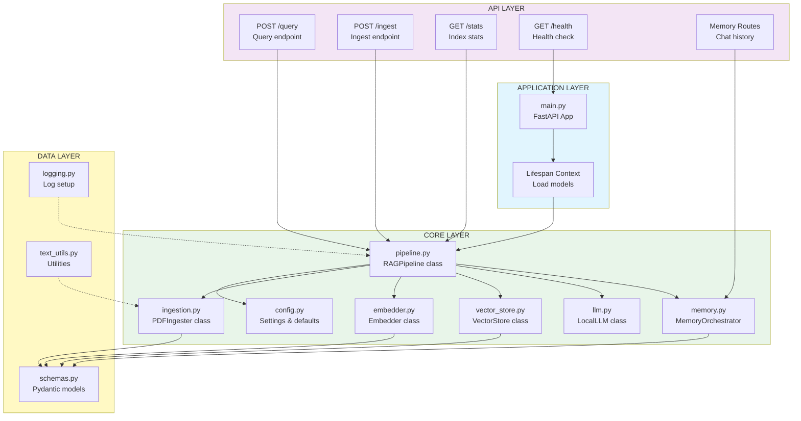

---

## 🎨 Arquitetura do Frontend

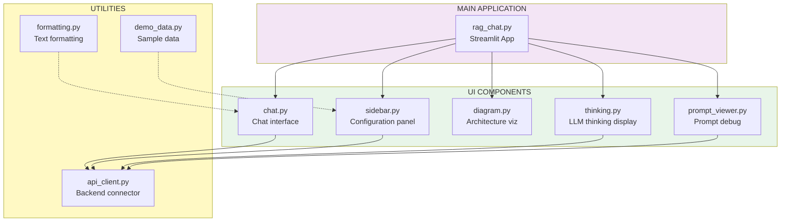

---

## 💾 Camada de Persistência

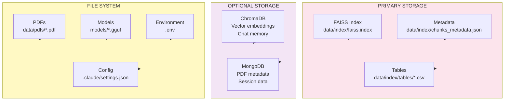

---

## 🔌 Fluxo de Comunicação

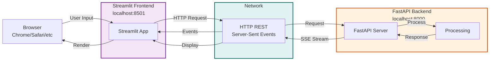

---

## 🌐 Deployment Architecture

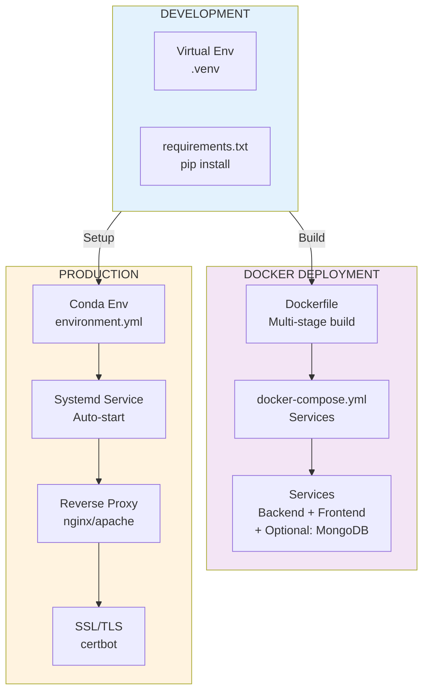

---

## 📈 Escalabilidade

### Limites Atuais
- **Documentos**: Testar até 1000 PDFs (depende de RAM)
- **Chunks**: ~100k chunks é limite prático
- **Throughput**: 1-2 queries/segundo (CPU-bound)

### Otimizações Possíveis
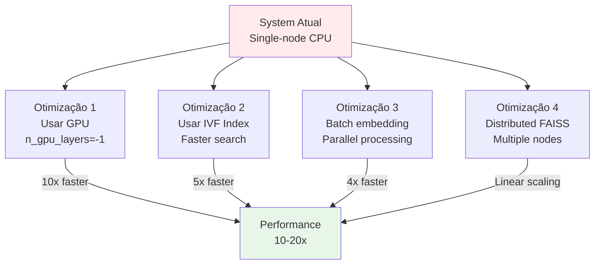

---

## 🔐 Segurança & Privacy

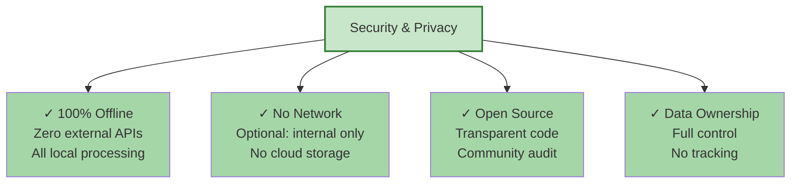

---

## 📚 Diagrama de Dependências

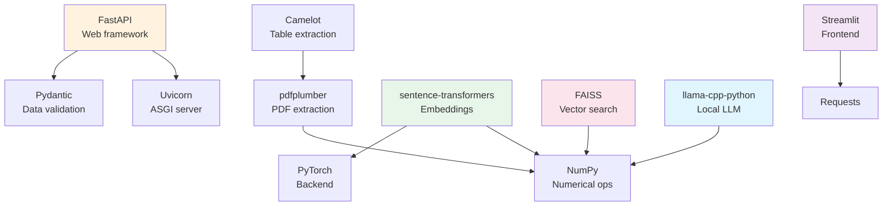

---

## 📝 Notas Técnicas

### Performance
- **Embedding**: ~100 docs/segundo (depende do hardware)
- **Query**: 0.5-2 segundos (retrieval + LLM generation)
- **Memory**: ~6GB RAM (embedder + LLM + index)

### Configuração Padrão
```yaml
chunk_size: 512 tokens
chunk_overlap: 64 tokens
embedding_model: BAAI/bge-m3 (1024-dim)
embedding_device: auto (MPS > CUDA > CPU)
llm_model: Mistral 7B Instruct (4-bit)
faiss_index: IndexFlatIP (exact search)
retrieval_top_k: 5
retrieval_final_k: 3
similarity_threshold: 0.35
mmr_lambda: 0.6
```

### Limites
- Max PDF size: Limited by available RAM
- Max chunks: ~500k (practical limit with FAISS)
- Max context: LLM context window (4096 tokens default)

---

## 🔄 Próximos Passos

1. **GPU Support**: Offload embedding & LLM to GPU
2. **Distributed Index**: FAISS distributed search
3. **Advanced Retrieval**: Hybrid search (BM25 + vector)
4. **Fine-tuning**: Custom embeddings para domain
5. **Caching**: Semantic caching para queries frequentes

---

**Última atualização**: Junho 2026  
**Versão**: 1.0.0  
**Status**: Production-Ready ✅
