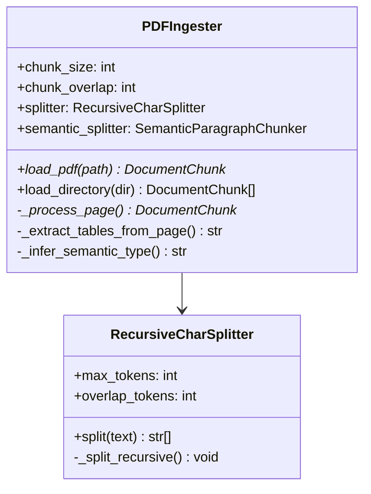
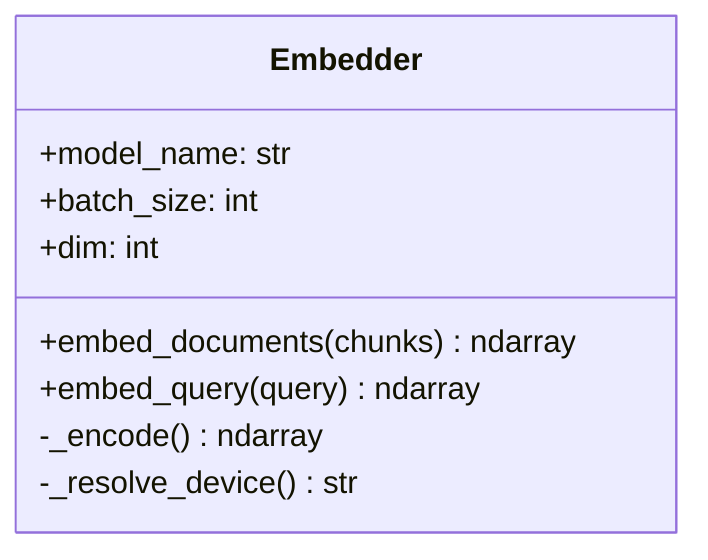
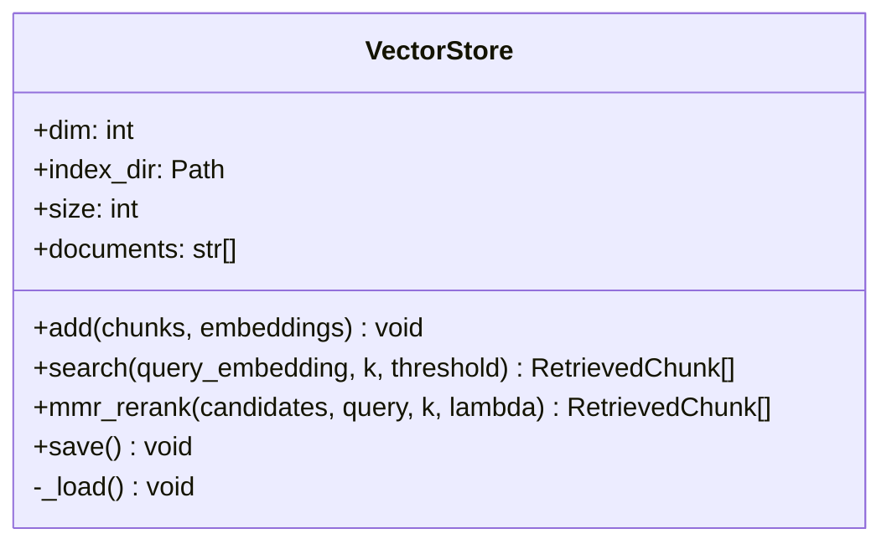
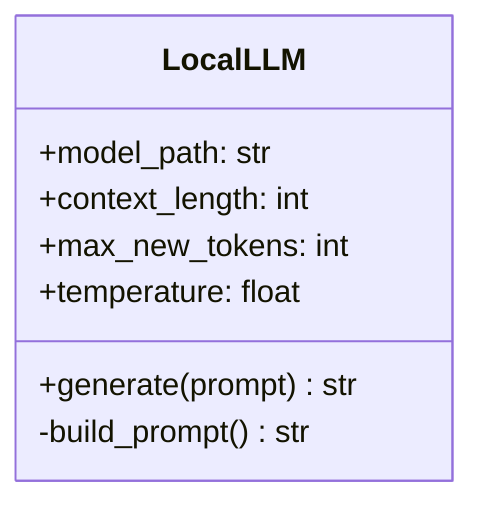
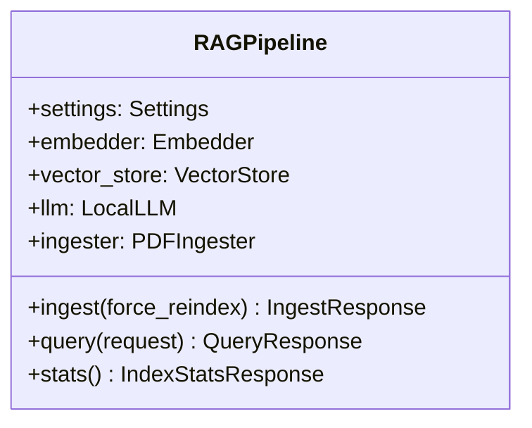
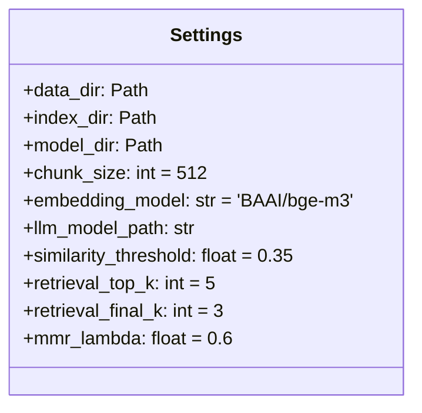
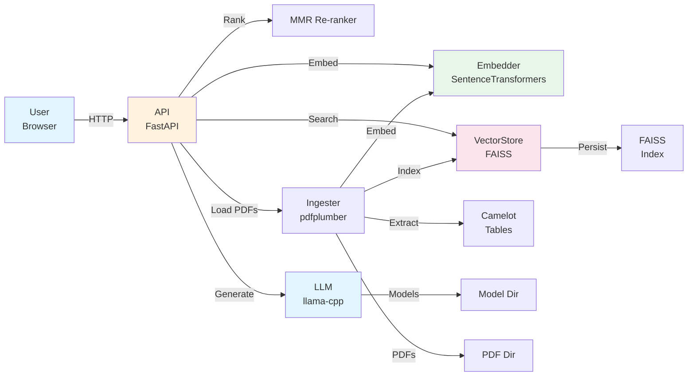

# Componentes do Sistema

Documentação detalhada de cada componente técnico do RAG.

## 📦 Backend Components

### 1. PDFIngester (`app/core/ingestion.py`)

**Responsabilidade**: Carregar PDFs, extrair texto e tabelas, dividir em chunks.



**Características**:
- Token-aware chunking
- Table extraction (Camelot + fallback)
- Header/footer removal
- Semantic type inference

**Entrada**: PDF files
**Saída**: `DocumentChunk[]` com metadata

---

### 2. Embedder (`app/core/embedder.py`)

**Responsabilidade**: Converter textos em vetores semânticos.



**Características**:
- Modelo: BAAI/bge-m3 (1024-dim, multilíngue)
- Normalização L2
- Device auto-detection (MPS/CUDA/CPU)
- Batch processing

**Entrada**: `DocumentChunk[]` ou query string
**Saída**: `ndarray[float32]` (N, 1024)

---

### 3. VectorStore (`app/core/vector_store.py`)

**Responsabilidade**: Indexar e buscar vetores similares.



**Características**:
- Índice: FAISS IndexFlatIP
- Exact cosine similarity search
- MMR (Maximal Marginal Relevance) re-ranking
- Persistência em disk

**Entrada**: Embeddings + chunks
**Saída**: `RetrievedChunk[]` (scored)

---

### 4. LocalLLM (`app/core/llm.py`)

**Responsabilidade**: Gerar respostas usando LLM local.



**Características**:
- Modelo: Mistral 7B Instruct (GGUF)
- 4-bit quantization
- CPU/GPU support
- Streaming capable

**Entrada**: Prompt com contexto
**Saída**: String com resposta

---

### 5. RAGPipeline (`app/core/pipeline.py`)

**Responsabilidade**: Orquestrar todo o fluxo RAG.



**Fluxo Query**:
```
1. Embed query
2. Search FAISS
3. MMR re-rank
4. Build prompt
5. Generate with LLM
```

**Fluxo Ingest**:
```
1. Load PDFs
2. Extract text + tables
3. Clean + chunk
4. Embed chunks
5. Index in FAISS
```

---

### 6. Settings (`app/core/config.py`)

**Responsabilidade**: Gerenciar configurações do sistema.



**Fonte**: Variáveis de ambiente + `.env`

---

## 🎨 Frontend Components

### 1. Main App (`frontend/rag_chat.py`)

Streamlit application principal.

**Responsabilidades**:
- Gerenciar estado da conversa
- Renderizar UI
- Fazer chamadas API
- Exibir resultados

---

### 2. Chat Component (`frontend/components/chat.py`)

Interface de chat.

**Características**:
- Message history
- Streaming responses
- User input form
- Response display

---

### 3. Sidebar (`frontend/components/sidebar.py`)

Painel de configuração.

**Características**:
- PDF upload
- Settings controls
- Index stats
- File management

---

### 4. APIClient (`frontend/utils/api_client.py`)

Comunicação com backend.

```python
class APIClient:
    async def query(query: str) -> AsyncGenerator[str]
    async def ingest(force: bool) -> IngestResponse
    async def stats() -> IndexStatsResponse
```

---

## 🔧 Utilitários

### Text Utils (`app/core/text_utils.py`)

```python
def clean_text(raw: str) -> str:
    # Normalização Unicode
    # Remove headers/footers
    # Collapse whitespace
    # Join hyphenated words

def estimate_tokens(text: str) -> int:
    # Heurística: chars/4
    # Acurado para EN/PT
```

---

### Logging (`app/utils/logging.py`)

Configuração de logging estruturado.

```
FORMAT: "%(asctime)s | %(levelname)-8s | %(name)s | %(message)s"
LEVEL: INFO (configurable)
```

---

## 🗂️ Data Schemas

### DocumentChunk

```python
class DocumentChunk(BaseModel):
    chunk_id: str
    text: str
    source_file: str
    page_number: int
    chunk_index: int
    total_chunks_in_page: int
    char_count: int
    token_estimate: int
    is_table: bool = False
    table_csv_path: Optional[str] = None
    semantic_type: Optional[str] = None
```

### RetrievedChunk

```python
class RetrievedChunk(BaseModel):
    chunk: DocumentChunk
    score: float  # 0-1 cosine similarity
```

### QueryRequest / QueryResponse

```python
class QueryRequest(BaseModel):
    question: str
    top_k: Optional[int] = None
    similarity_threshold: Optional[float] = None

class QueryResponse(BaseModel):
    question: str
    answer: str
    retrieved_chunks: RetrievedChunkResponse[]
    full_prompt: str
    found_in_documents: bool
    latency_ms: float
```

---

## 🔌 API Endpoints

### POST /api/v1/query

Fazer pergunta sobre documentos.

**Request**:
```json
{
  "question": "Qual é o tema principal?",
  "top_k": 5,
  "similarity_threshold": 0.35
}
```

**Response** (SSE Stream):
```
data: {"type": "thinking", "content": "..."}
data: {"type": "chunk", "content": "..."}
data: {"type": "done", "result": {...}}
```

---

### POST /api/v1/ingest

Ingerir PDFs do diretório.

**Request**:
```json
{
  "force_reindex": false
}
```

**Response**:
```json
{
  "chunks_indexed": 1000,
  "documents_processed": 5,
  "latency_ms": 5000.0
}
```

---

### GET /api/v1/stats

Obter estatísticas do índice.

**Response**:
```json
{
  "total_chunks": 1000,
  "documents": ["doc1.pdf", "doc2.pdf"],
  "index_type": "flat",
  "embedding_model": "BAAI/bge-m3",
  "embedding_dim": 1024
}
```

---

### GET /health

Health check.

**Response**:
```json
{
  "status": "ok",
  "version": "1.0.0"
}
```

---

## 🔄 Component Interactions



---

## 📊 Data Flow

### Ingest Flow

```
PDFs
  ↓
PDFIngester.load_directory()
  ├→ PDFIngester.load_pdf()
  │   ├→ pdfplumber.open()
  │   ├→ extract_text()
  │   ├→ _extract_tables_from_page()
  │   │   ├→ Camelot (lattice)
  │   │   ├→ Camelot (stream)
  │   │   └→ pdfplumber fallback
  │   ├→ clean_text()
  │   └→ RecursiveCharSplitter.split()
  │
  └→ DocumentChunk[]
      ↓
      Embedder.embed_documents()
      ↓
      ndarray[N, 1024]
      ↓
      VectorStore.add()
      ↓
      FAISS Index + Metadata JSON
```

### Query Flow

```
User Query
  ↓
QueryRequest validation
  ↓
Embedder.embed_query()
  ↓
Query Vector [1, 1024]
  ↓
VectorStore.search()
  ├→ FAISS.search()
  ├→ Filter by threshold
  └→ RetrievedChunk[]
      ↓
      MMR re-ranking
      ↓
      Top K chunks selected
      ↓
      build_prompt()
      ↓
      Full Prompt
      ↓
      LocalLLM.generate()
      ↓
      Response tokens
      ↓
      QueryResponse
      ↓
      User Display
```

---

**Última atualização**: Junho 2026  
**Versão**: 1.0.0
