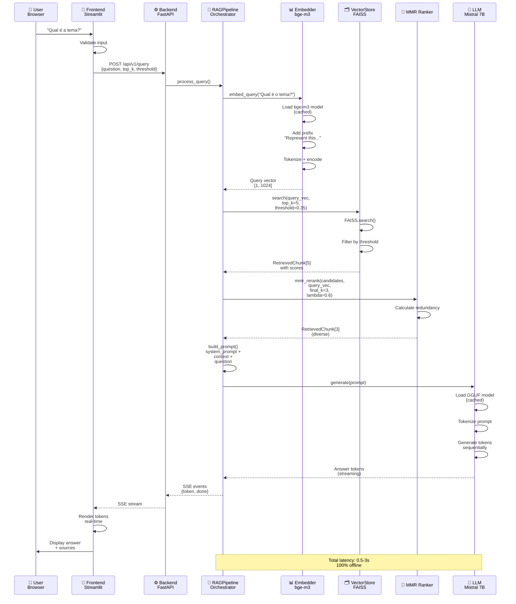
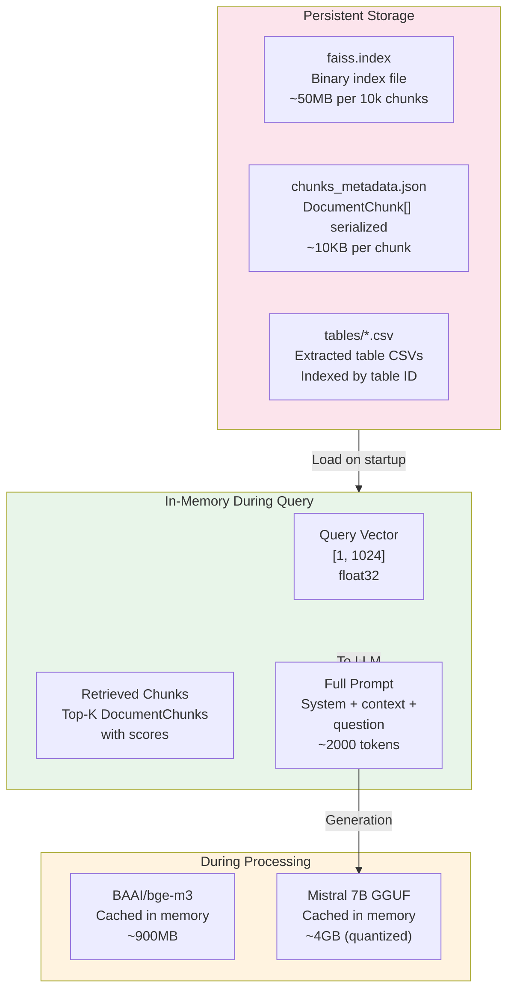
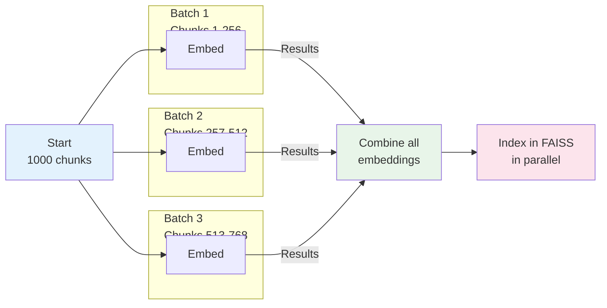
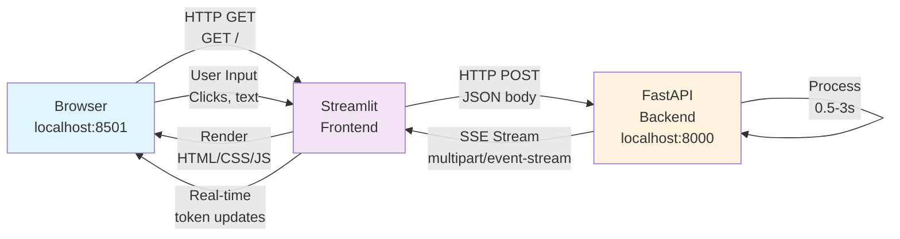

# Fluxos de Dados

Documentação detalhada dos fluxos de dados end-to-end do sistema.

## 🔄 Fluxo de Query (Pergunta)



---

## 📥 Fluxo de Ingestão (Ingest)

```mermaid
graph TD
    Start["🚀 Start Ingestion<br/>POST /api/v1/ingest"] --> CheckIndex["Check if index<br/>already exists"]
    CheckIndex -->|Exists + no force| Return["Return stats<br/>Skip processing"]
    CheckIndex -->|New or force| Scan["Scan data/pdfs/<br/>Find all PDFs"]
    
    Scan --> LoadPDF["Load PDF<br/>pdfplumber.open"]
    LoadPDF --> DetectHeaders["[Optional]<br/>Detect headers/<br/>footers"]
    
    DetectHeaders --> PageLoop["For each page"]
    
    PageLoop --> ExtractText["Extract text<br/>page.extract_text"]
    
    ExtractText --> ExtractTables["Extract tables<br/>Try Camelot"]
    
    ExtractTables -->|Camelot lattice| CamelotL["Camelot lattice flavor"]
    CamelotL -->|Success| FormatCamelot["Format to Markdown/<br/>CSV"]
    CamelotL -->|Fail| CamelotS["Camelot stream flavor"]
    CamelotS -->|Success| FormatCamelot
    CamelotS -->|Fail| PDFPlumber["pdfplumber fallback"]
    PDFPlumber --> FormatPDF["Format to text"]
    
    FormatCamelot --> Combine["Combine text +<br/>tables"]
    FormatPDF --> Combine
    
    Combine --> CleanText["clean_text()<br/>Normalize + remove<br/>headers/footers"]
    
    CleanText --> Chunk["RecursiveCharSplitter<br/>Token-aware chunking"]
    Chunk --> ChunkList["DocumentChunk[]"]
    
    ChunkList --> BatchEmbed["Batch embedding<br/>256 chunks/batch"]
    BatchEmbed --> EmbedModel["Load bge-m3 model"]
    EmbedModel --> EmbedProc["Encode chunks<br/>→ [N, 1024]"]
    
    EmbedProc --> FAISS["Add to FAISS"]
    FAISS --> SaveIndex["Save index<br/>faiss.index +<br/>metadata.json"]
    
    SaveIndex --> OptionalStore["[Optional]<br/>ChromaDB +<br/>MongoDB"]
    
    OptionalStore --> Done["✅ Ingest complete"]
    Done --> Stats["Return IngestResponse<br/>chunks_indexed,<br/>documents_processed,<br/>latency_ms"]
    
    Return --> End["🏁 End"]
    Stats --> End
    
    style Start fill:#E3F2FD,stroke:#1976D2,stroke-width:2px
    style Done fill:#C8E6C9,stroke:#2E7D32,stroke-width:2px
    style End fill:#FFE0B2,stroke:#E65100,stroke-width:2px
```



---

## 📊 Query Flow Detailed

### 1. Query Reception & Validation

```
HTTP POST /api/v1/query
{
  "question": "What is the main topic?",
  "top_k": 5,
  "similarity_threshold": 0.35
}
    ↓
Pydantic validation
QueryRequest(
  question="What is the main topic?" ✓
  top_k=5 ✓
  similarity_threshold=0.35 ✓
)
    ↓
Pass to RAGPipeline.query()
```

### 2. Query Embedding

```
"What is the main topic?"
    ↓
Add BGE prefix
"Represent this sentence for searching: What is the main topic?"
    ↓
Tokenize
[Represent, this, sentence, for, searching, :, What, is, ...]
    ↓
Load model (if not cached)
sentence-transformers/bge-m3
    ↓
Forward pass
    ↓
Output: [1024-dim vector]
Normalized (L2)
```

### 3. Vector Search

```
Query vector [1, 1024]
    ↓
FAISS.search(query_vec, k=5)
    ↓
Find 5 nearest neighbors
Using inner-product (= cosine for normalized)
    ↓
Get indices [idx1, idx2, idx3, idx4, idx5]
and scores [0.92, 0.88, 0.76, 0.34, 0.20]
    ↓
Filter by threshold (0.35)
[0.92✓, 0.88✓, 0.76✓, 0.34✗, 0.20✗]
    ↓
Retrieve chunks
RetrievedChunk[3]
```

### 4. MMR Re-ranking

```
RetrievedChunk[3]
- Chunk1 (relevance=0.92)
- Chunk2 (relevance=0.88)
- Chunk3 (relevance=0.76)
    ↓
Calculate diversity
MMR = λ·relevance - (1-λ)·redundancy
λ = 0.6
    ↓
Final selection
Same order (already diverse)
    ↓
RetrievedChunk[3] (final)
```

### 5. Prompt Building

```
System Prompt:
"You are a document analysis assistant.
Use ONLY the provided context.
If info not found, say: 'Not found in documents.'
Always cite sources."

Retrieved Context:
"[Page 5] Topic is about AI...
[Page 10] Main focus on NLP...
[Page 15] Applications in healthcare..."

User Question:
"What is the main topic?"

Final Prompt:
"You are a document analysis assistant...

Context:
[Page 5] Topic is about AI...
[Page 10] Main focus on NLP...
[Page 15] Applications in healthcare...

Question: What is the main topic?

Answer:"
    ↓
Pass to LLM
```

### 6. LLM Generation

```
Full Prompt
    ↓
Load GGUF model (if not cached)
    ↓
Tokenize prompt
    ↓
Generate tokens sequentially
Temperature=0.1 (deterministic)
Max new tokens=512
    ↓
Stream tokens to client
"The main topic is..." (token by token)
    ↓
Stop on </s> or max tokens
    ↓
Final answer ready
```

---

## 💾 Data Structure Diagram



---

## 🔄 Concurrent Processing



---

## 🔄 Error Handling Flows

### Query Error Flow

```
Query Request
    ↓
Validation Error?
    ├→ YES: Return 400 Bad Request
    └→ NO: Continue
    
Embedding Error?
    ├→ YES: Log error, return 500
    └→ NO: Continue
    
Search Error?
    ├→ YES: Return empty results
    └→ NO: Continue
    
LLM Error?
    ├→ YES: Return partial response
    └→ NO: Complete response
```

### Ingest Error Flow

```
Ingest Request
    ↓
PDF Access Error?
    ├→ YES: Skip file, log warning
    └→ NO: Continue
    
Extract Error?
    ├→ YES: Use fallback method
    └→ NO: Continue
    
Embedding Error?
    ├→ YES: Mark chunks as failed
    └→ NO: Continue
    
FAISS Error?
    ├→ YES: Log critical, rollback
    └→ NO: Persist index
```

---

## 🌐 Network Flow



---

## 📈 Performance Timeline

### Typical Query (3 seconds)

```
0.0s:  POST request received
0.1s:  Query embedding (0.1s)
0.2s:  FAISS search (0.1s)
0.3s:  MMR re-rank (0.05s)
0.35s: Prompt building (0.05s)
0.4s:  LLM context loading (0.05s)
0.5s:  Generation started
1.5s:  Mid-generation (50% done)
3.0s:  Generation complete
       Total: 2.5s processing + 0.5s overhead
```

### Typical Ingest (5 minutes for 100 PDFs)

```
0.0s:    Start
10s:     PDFs loaded
20s:     Text extracted
30s:     Tables extracted
40s:     Text cleaned & chunked
1m 20s:  Embeddings generated (batch processing)
2m 30s:  FAISS index built
2m 40s:  Metadata saved
5m 00s:  Complete
         ~100 documents, 10k chunks, ~500MB index
```

---

**Última atualização**: Junho 2026  
**Versão**: 1.0.0
